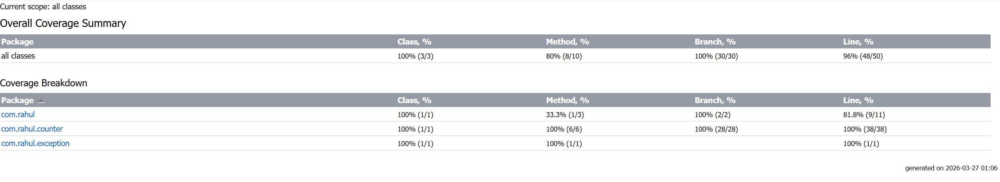

# ImageLineCounter

A Java console application that counts vertical black lines in black-and-white JPEG images created with MS Paint.

## Requirements

- Java 8 or higher
- Maven 3.x (to build from source)

## Building

```
mvn package
```

This produces `target/ImageLineCounter.jar`.

## Usage

```
java -jar target/ImageLineCounter.jar <absolute-path-to-image>
```

**Example:**
```
java -jar target/ImageLineCounter.jar C:\images\img_1.jpg
```

The application prints a single number representing the count of vertical black lines detected.

## Input Requirements

- File must be a `.jpg` or `.jpeg` image
- Image must be black and white (no colour pixels)
- Lines must be vertical and created using MS Paint

## Exit Codes

| Code | Meaning |
|------|---------|
| 0 | Success |
| 1 | Wrong number of arguments |
| 2 | Error processing the image |

## Running from IntelliJ IDEA

1. Open **Run > Edit Configurations**
2. Click **+** and select **Application**
3. Set **Main class** to `com.rahul.App`
4. Set **Program arguments** to the absolute path of your image, e.g. `C:\images\img_1.jpg`
5. Click **Run**

## Running Tests

```
mvn test
```

## Code Coverage



## How It Works

The algorithm scans each column of pixels in the top half of the image (the spec guarantees every line is continuous across both halves). A column is classified as part of a line if it contains at least one dark pixel. Consecutive line-columns are grouped together and counted as a single line.

JPEG compression is handled by using a brightness threshold of 128 rather than checking for exact black pixels, and by validating that all pixels are grayscale (R ≈ G ≈ B) rather than coloured.
